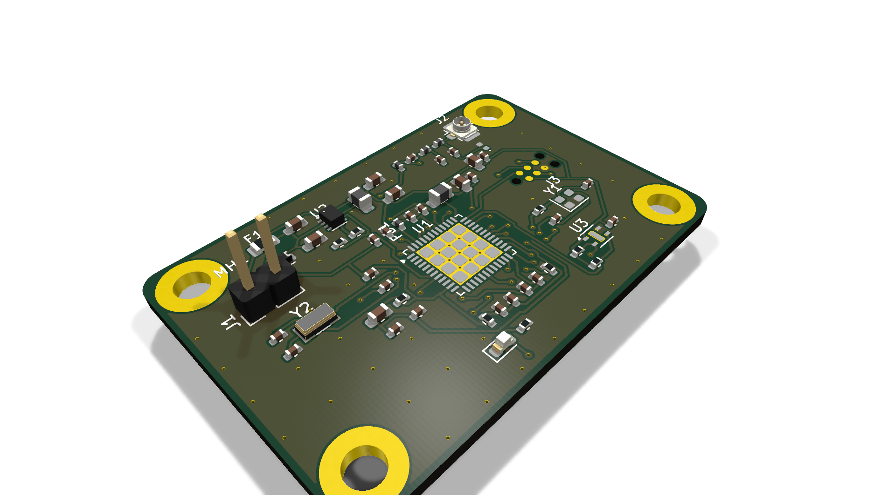
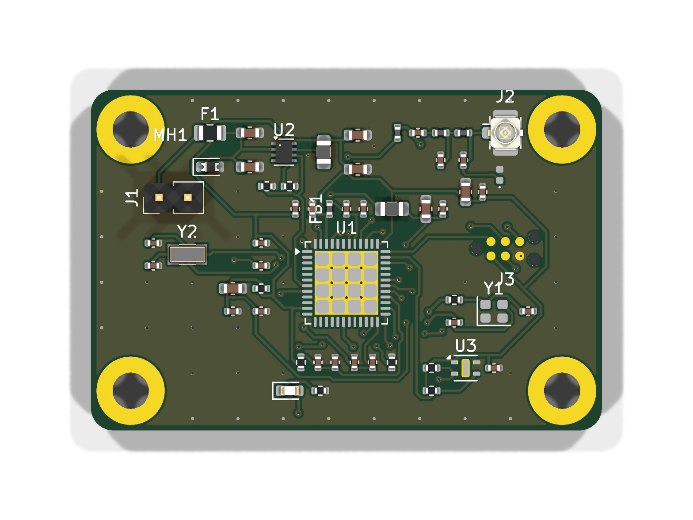
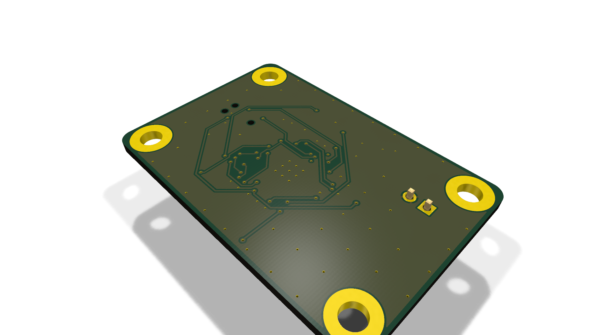
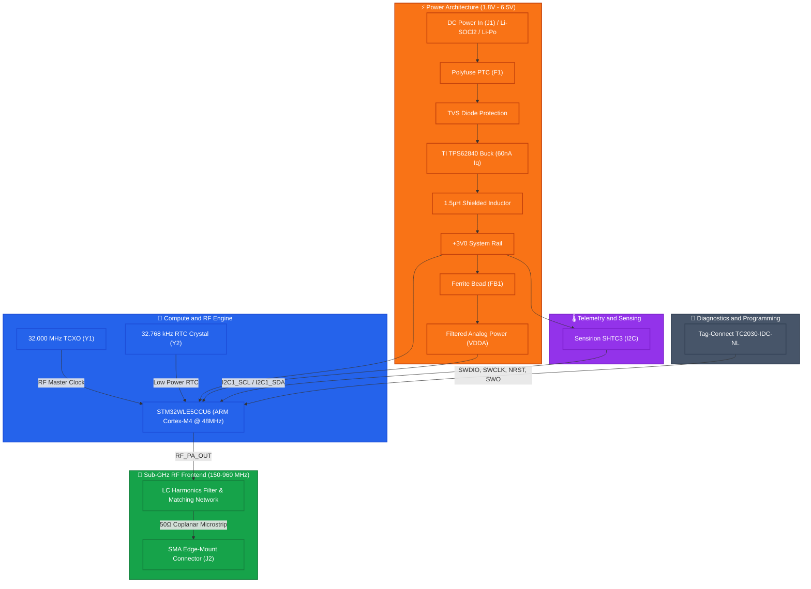
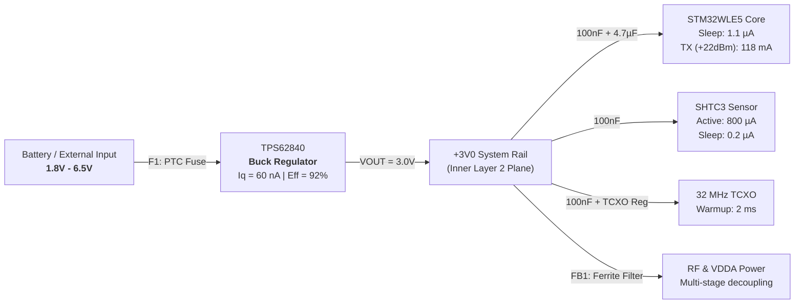

# CHIPDOWNARM | Sub-GHz LoRaWAN & Industrial Telemetry Node

CHIPDOWNARM is a highly optimized, industrial-grade IoT telemetry edge node designed for mission-critical Sub-GHz LPWAN networks, remote monitoring, and smart agriculture deployments. Built around the high-performance **STMicroelectronics STM32WLE5** (ARM Cortex-M4 with integrated Sub-GHz LoRa/FSK transceiver), it delivers robust long-range communication with an ultra-low power footprint.

The board follows rigorous IPC (IPC-2152, IPC-2221) standards, featuring a wide-input high-efficiency switching power architecture (TPS62840), a highly stable 32MHz TCXO for RF precision, and an optimized 4-layer controlled-impedance stackup for impeccable RF Signal Integrity (SI) and Power Integrity (PI).

---

## 📸 Photorealistic 3D Renders

<p align="center">
  
</p>

<p align="center">
  
  
</p>

---

## 🏛️ System Architecture Diagram



---

## ⚡ Power Tree & Energy Profile



---

## 🔬 PCB Layer Stackup & Controlled Impedance

The PCB is built on an industrial 4-Layer standard stackup (1.6mm nominal thickness, 1 oz / 35µm copper outer and inner layers) to guarantee excellent RF containment.

```text
========================================================================================
Layer 1 (Top / F.Cu): Component SMD Pads, 50Ω RF Coplanar Microstrips, Buck Power Loop
---------------------------------- Dielectric Prepreg (0.21mm, FR-4, Er=4.5) -----------
Layer 2 (Inner 1 / In1.Cu): Solid Continuous Ground Plane (GND) - Zero Slots
---------------------------------- Core Dielectric (1.065mm, FR-4, Er=4.5) -------------
Layer 3 (Inner 2 / In2.Cu): Dedicated +3V0 Power Plane & RF Return Shield
---------------------------------- Dielectric Prepreg (0.21mm, FR-4, Er=4.5) -----------
Layer 4 (Bottom / B.Cu): Digital Control Signals & Secondary Ground Shield
========================================================================================
```

### 🗺️ Individual Layer Vector Views

| Layer | Type | Function & High-Speed Details | Vector Preview |
| :--- | :--- | :--- | :--- |
| **L1 (F.Cu)** | Signal / RF | 50Ω Coplanar RF track, SMPS power loop, MCU breakouts | [View SVG](docs/img/layer_l1_top.svg) |
| **L2 (In1.Cu)** | Solid GND | 100% continuous reference ground, zero ground slots | [View SVG](docs/img/layer_l2_gnd.svg) |
| **L3 (In2.Cu)** | Power | Dedicated +3V0 power plane, ultra-low impedance distribution | [View SVG](docs/img/layer_l3_pwr.svg) |
| **L4 (B.Cu)** | Signal / Shield | I2C routing, debug traces, stitched ground plane | [View SVG](docs/img/layer_l4_bottom.svg) |

---

## ⚡ Technical Specifications

| Parameter | Specification | Engineering Details |
| :--- | :--- | :--- |
| **Input Supply Voltage** | **1.8V − 6.5V DC** | Polyfuse protection (F1) + Battery input conditioning for Li-Po/Li-SOCl2. |
| **Main Step-Down Converter** | **TI TPS62840 (1.8V-6.5V)** | Ultra-low $I_q$ (60 nA) high-efficiency buck regulator with compact shielded inductor. |
| **Main Processing Unit (MCU)** | **STM32WLE5CCU6** | ARM Cortex-M4 @ 48MHz, 256KB Flash, 64KB SRAM, integrated Sub-GHz Radio. |
| **Wireless Connectivity** | **LoRa / (G)FSK / (G)MSK** | Sub-GHz Radio (150 MHz to 960 MHz) compatible with LoRaWAN protocols. |
| **RF Clock Source** | **32.000 MHz TCXO** | High-stability Temperature Compensated Oscillator for precise RF modulation. |
| **Telemetry Sensor** | **Sensirion SHTC3** | Ultra-low power I2C Temperature and Humidity sensor (±2.0% RH, ±0.2°C). |
| **Debug Interface** | **SWD via Tag-Connect** | Zero-cost, zero-profile TC2030-IDC-NL footprint (No Legs) for SWD & SWO. |
| **RF Interface** | **SMA Edge-Mount** | 50Ω impedance-matched Coplanar Waveguide routing to SMA connector. |
| **Design Rule Check (DRC)** | **100% Passed (0 Errors)** | 0 Unrouted airwires, 0 clearance errors, full IPC-2221 compliance. |

---

## 📋 Comprehensive Bill of Materials (BOM)

| Item | Qty | Component / Value | Manufacturer | MPN | Description |
| :--- | :--- | :--- | :--- | :--- | :--- |
| **U1** | 1 | **STM32WLE5CCU6** | STMicroelectronics | STM32WLE5CCU6 | ARM Cortex-M4 Sub-GHz LoRa SoC (UFQFPN-48) |
| **U2** | 1 | **TPS62840DLCR** | Texas Instruments | TPS62840DLCR | Ultra-Low Iq Step-Down Converter |
| **U3** | 1 | **SHTC3** | Sensirion | SHTC3 | I2C Humidity and Temperature Sensor |
| **Y1** | 1 | **NT2016SA-32M** | NDK | NT2016SA-32M | 32.000MHz TCXO (Temperature Compensated) |
| **J1** | 1 | **SMA Edge-Mount** | Amphenol | 132136 | 50Ω SMA RF Connector |
| **J3** | 1 | **TC2030-IDC-NL** | Tag-Connect | TC2030-IDC-NL | 6-pin No-Legs SWD Programming Header |

*(For passive components, resistors, MLCCs, and exact footprints, please see [CHIPDOWNARM_BOM.xml](CHIPDOWNARM_BOM.xml))*

---

## 📁 Repository Structure

```text
CHIPDOWNARM/
├── CHIPDOWNARM.kicad_pcb        # KiCad 8/9 PCB Layout File (4-Layer, 0 DRC Errors)
├── CHIPDOWNARM.kicad_sch        # KiCad Schematic File
├── CHIPDOWNARM.kicad_pro        # KiCad Project Definitions
├── CHIPDOWNARM_Schematic.pdf    # Complete vector schematic PDF
├── CHIPDOWNARM.step             # High-precision 3D mechanical model (STEP AP214)
├── CHIPDOWNARM_BOM.xml          # Sourcing Bill of Materials
├── gerbers/                     # Standard RS-274X Fabrication Gerbers & Excellon Drills
│   ├── CHIPDOWNARM-F_Cu.gtl     # Top Copper Layer
│   ├── CHIPDOWNARM-In1_Cu.g1    # Layer 2 Ground Plane
│   ├── CHIPDOWNARM-In2_Cu.g2    # Layer 3 Power Plane
│   ├── CHIPDOWNARM-B_Cu.gbl     # Bottom Copper Layer
│   ├── CHIPDOWNARM.drl          # NC Drill file
│   └── ...                      # Masks, silkscreens, edge cuts
├── docs/
│   └── img/                     # 3D Photorealistic raytracing renders & SVG layer previews
│       ├── render_isometric_top.png
│       ├── render_isometric_bottom.png
│       ├── render_top.png
│       └── layer_l*.svg
├── .gitignore                   # Clean Git configuration for EDA projects
└── README.md                    # Comprehensive hardware documentation
```

---

## 🚀 How to Build & Open the Project

### Prerequisites
* EDA Suite: **[KiCad 8.0+](https://www.kicad.org/)** (Fully tested on KiCad 8 & 9).

### Opening in KiCad
1. Clone the repository:
   ```bash
   git clone https://github.com/8aChristian/CHIPDOWNARM.git
   cd CHIPDOWNARM
   ```
2. Open `CHIPDOWNARM.kicad_pro` inside KiCad.
3. Open the **Schematic Editor** to review the architecture.
4. Open the **PCB Editor** and hit `B` to recalculate all zone fills and inspect the perfectly clean 4-layer layout.
5. Press `Alt + 3` to open the interactive 3D viewer.

---

## 📜 License & Author

**Author**: Christian Ochoa ([@8aChristian](https://github.com/8aChristian))  
**Status**: Ready for Fabrication (0 Unrouted, 0 DRC Violations)  
**License**: Released under the MIT License.
